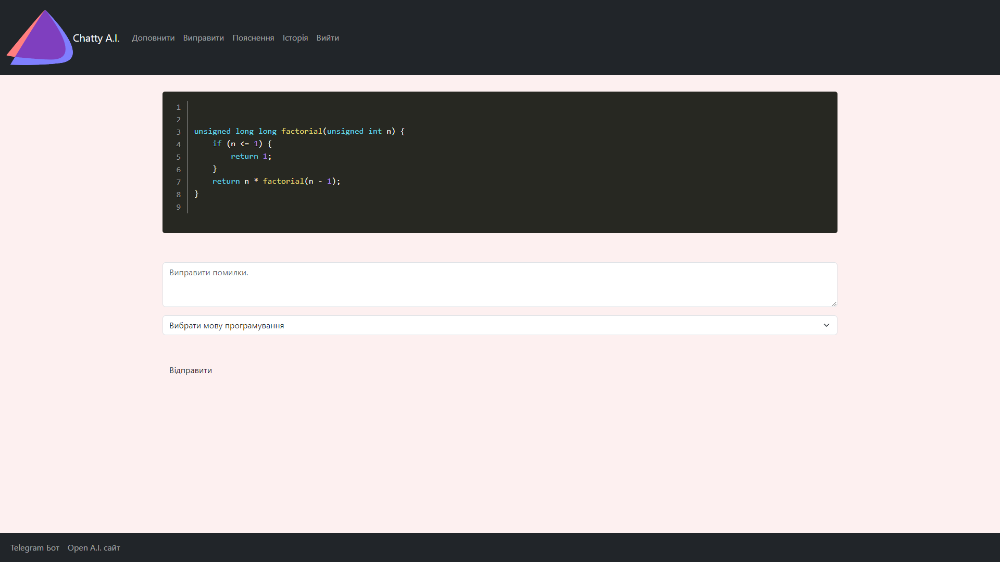

# Running the Django-AI-site Project 



## Clone the Repository

First, clone the project repository from GitHub:

```bash
git clone https://github.com/YuriiDorosh/Django-AI-site.git
```

## Navigate to the Project Directory

Navigate to the project directory that you just cloned:

```bash
cd Django-AI-site
```

## Create a .env File

Create a .env file in the project directory and define the required environment variables. You can use a text editor to create and edit the file. Here's an example of the contents of the .env file:

```bash
API_KEY='Your OpenAI API Key'
SECRET_KEY='Your Django Secret Key'
DB_NAME='Your Database Name'
DB_USER='Your Database User'
DB_PASSWORD='Your Database Password'
DB_HOST='db'
```

Replace the placeholders with your actual API key, secret key, database information, and any other required settings.

## 1. Running the Project Locally

Create a virtual environment (if not already created) and install project dependencies:

```bash
python3 -m venv venv  # Create a virtual environment
source venv/bin/activate  # Activate the virtual environment (Linux)
pip install -r requirements.txt  # Install project dependencies
```

Run the Django development server:
```bash
python manage.py runserver
```

## 2. Running the Project with Docker

### Prerequisites

Make sure you have the following prerequisites installed on your computer:

- Docker: [Install Docker](https://docs.docker.com/get-docker/)
- Docker Compose: [Install Docker Compose](https://docs.docker.com/compose/install/)


Build and start the project containers using Docker Compose and the Makefile:

```bash
make docker-up
```

Access the project in your web browser at http://localhost:8000/.

To stop the project and containers, you can use:

```bash
make docker-down
```

## 3. Running the Project with Makefile (without Docker)

Run the Django development server using the Makefile:

```bash
make run
```

## Issues and Contributions

If you encounter any issues or have suggestions for improvements, feel free to open an issue on this GitHub repository. We welcome contributions from the community. If you'd like to contribute code, please create a pull request.

## License

This project is licensed under the MIT License. You can find the license details in the [LICENSE](LICENSE) file. Feel free to use, modify, and distribute the code as per the terms of the MIT License.
